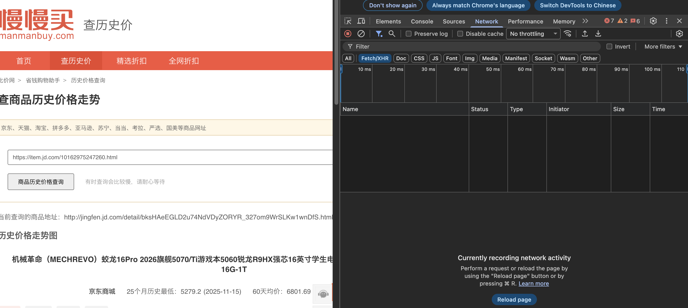
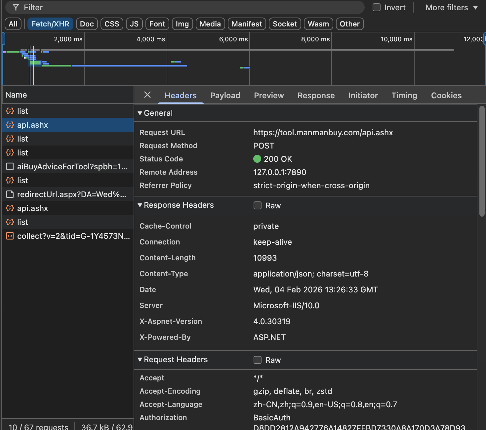
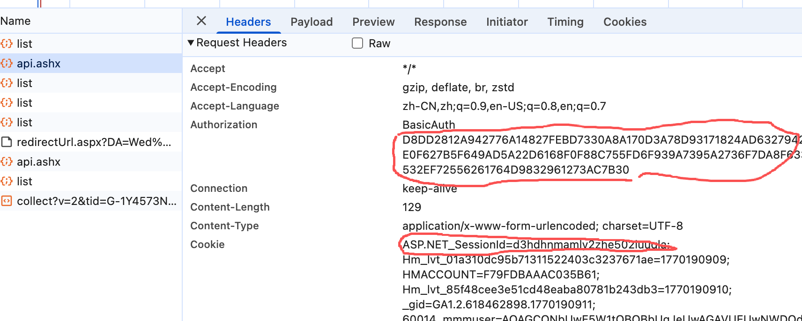

# manmanbuy-history-api

慢慢买这个网站获取历史价格的这个 API

## 包含内容

- `docs/api.md` - 接口、请求头、参数、签名逻辑
- `examples/request_params.json` - 请求参数示例
- `examples/response_sample.json` - 响应示例
- `requirements.txt` - Python 依赖列表
- `.gitignore` - 常见忽略项

## 快速开始（本地）

1) 安装依赖：

```bash
pip install -r requirements.txt
```

2) 运行示例程序：

```bash
python examples/sample_client.py
```

3) 将示例程序中的占位值替换为真实值后再次运行：`AUTHORIZATION` 与 `COOKIE`。

   填写完成后应类似如下（以示例程序为准）：

   ```python
   authentication = "BasicAuth EXAMPLE_AUTH_VALUE"
   cookie = "ASP.NET_SessionId=EXAMPLE_SESSION_ID; ..."
   ```

   **获取 `AUTHORIZATION` 与 `COOKIE`（截图示例）**

   图片统一放在 `assets/screenshots/` 目录。

   1) 登录慢慢买网站并进入商品查询页面。

   

   2) 打开开发者工具，切到 Network，选择 Fetch/XHR，然后随便查询一个商品价格。

   

   3) 在请求列表中找到 `api.ashx`，在右侧详情里复制 `authorization` 与 `cookie`，填入示例程序。

   

## 示例程序说明

示例程序位于 `examples/sample_client.py`，它会请求接口并直接打印 API 返回的 JSON。

## 示例输出

```json
{
  "msg": "",
  "code": 0,
  "data": {
    "haveTrend": 1,
    "siteName": "京东商城",
    "currentPrice": 6499.0,
    "spName": "示例商品名称",
    "datePrice": "[时间戳,价格,\"备注\"],..."
  },
  "count": 0
}
```

## 重要提醒

- 本仓库不包含任何真实凭据。
- 不要将 `AUTHORIZATION` 或 `COOKIE` 提交到 GitHub。
- 请遵守目标网站的使用条款与访问频率限制。

## 许可证

如果你计划公开，请添加许可证。示例项目常用 MIT。
